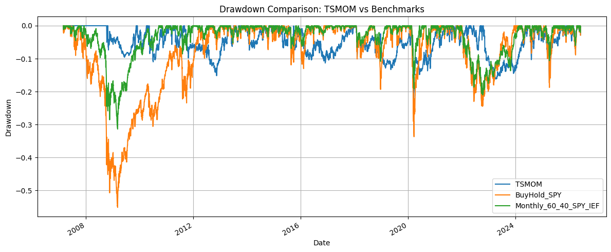
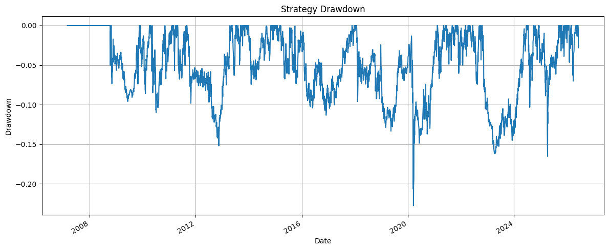
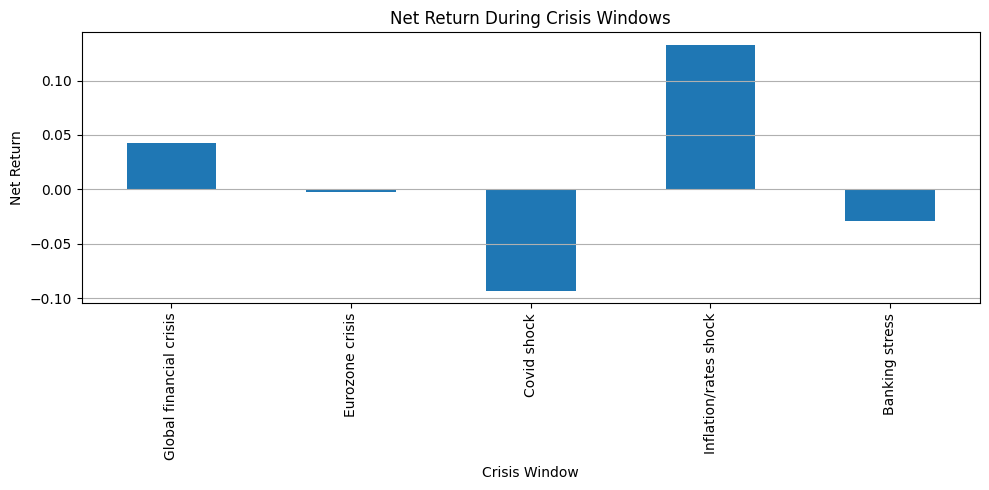
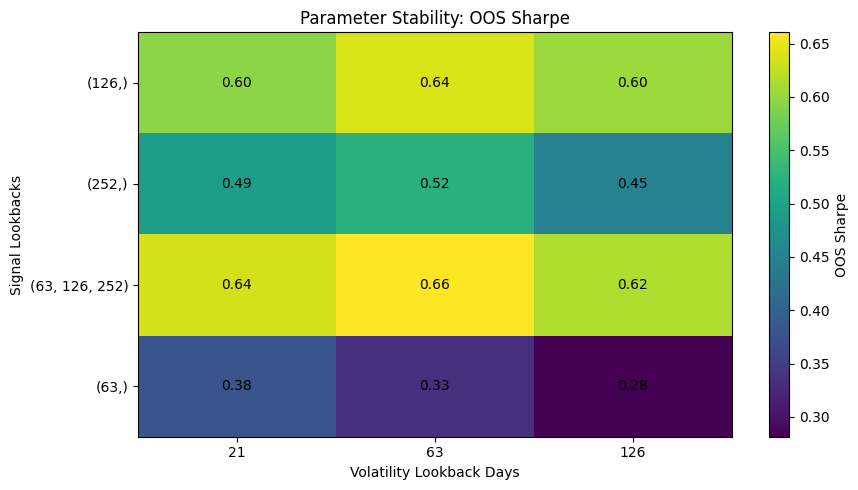
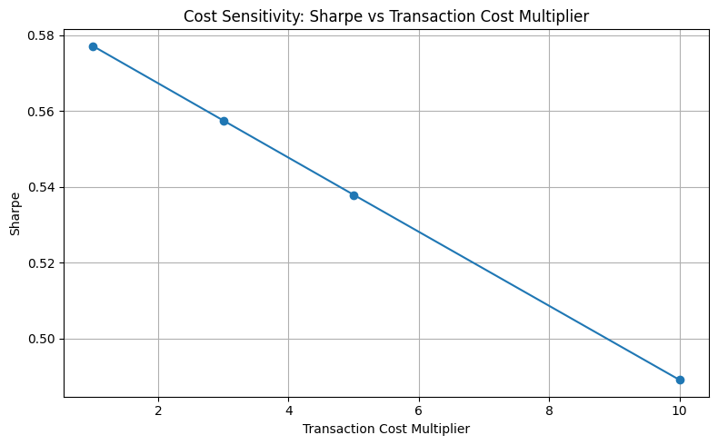

Market-risk and model-validation case study using a multi-asset time-series momentum strategy.

## 1. Executive Summary

This repository implements a cross-asset time-series momentum framework using liquid ETF proxies across equities, rates, FX, and commodities.

The project is designed as a risk-controlled systematic research pipeline rather than a production-ready alpha strategy. The main objective is to show how a systematic strategy can be researched, tested, and evaluated under realistic risk and implementation constraints.

The framework covers signal construction, volatility scaling, portfolio constraints, transaction costs, turnover controls, in-sample and out-of-sample validation, parameter stability testing, benchmark comparison, crisis-period attribution, and failure-case analysis.

The final model uses 13 liquid ETF proxies from March 2007 to June 2026, covering several important market regimes: the global financial crisis, the Eurozone crisis, Covid, the 2022 inflation/rates shock, and the 2023 banking stress period.

The strategy produces positive full-sample and out-of-sample performance. However, it does not dominate a monthly 60/40 benchmark on Sharpe. The correct interpretation is therefore not that this is a superior replacement for equity or balanced-portfolio beta, but that it is a controlled market-risk and model-validation case study.

The main risk-management value of the project is its transparent treatment of drawdown behaviour, stress-period performance, parameter robustness, transaction-cost sensitivity, exposure limits, and model failure cases.

---

## 2. Why This Matters for Risk Management

Although the test object is a systematic investment strategy, the project is framed as a risk-management exercise. The focus is not only on return generation, but on understanding how model assumptions, portfolio constraints, market regimes, and implementation costs affect realised risk.

### Market Risk

The project evaluates market risk through:

* Full-sample and out-of-sample performance.
* Maximum drawdown analysis.
* Crisis-window returns.
* Benchmark comparison against SPY and a monthly rebalanced 60/40 SPY/IEF portfolio.
* Asset and asset-class exposure constraints.
* Portfolio volatility targeting.
* Cap-utilisation diagnostics.

The most important market-risk result is that the strategy achieves a lower maximum drawdown than both SPY and the monthly 60/40 benchmark, even though it does not beat the 60/40 benchmark on Sharpe.

### Model Risk

The project treats the trading rule as a model that requires validation rather than as a black-box strategy. Model risk is addressed through:

* In-sample versus out-of-sample testing.
* Parameter-stability analysis.
* Multi-horizon signal design.
* Benchmark comparison.
* Explicit discussion of weak regimes and failure cases.
* Sensitivity tests around volatility targeting and asset-level volatility assumptions.

The Covid period is treated as a clear model failure case, showing the lag risk of medium-term trend-following signals during abrupt market crashes.

### Implementation Risk

The framework includes several implementation-aware features:

* Monthly rebalancing.
* Turnover controls.
* Asset-specific transaction-cost assumptions.
* Stressed transaction-cost scenarios using 3x, 5x, and 10x cost multipliers.
* Gross leverage cap.
* Asset-level and asset-class-level concentration limits.

The transaction-cost model remains simplified, but it is included explicitly so that performance is not presented as a frictionless backtest.

### Stress Testing

The project evaluates behaviour across major market regimes, including:

* Global financial crisis.
* Eurozone crisis.
* Covid shock.
* 2022 inflation/rates shock.
* 2023 banking stress period.
* Whipsaw years such as 2012, 2016, and 2023.

The stress-testing section is intended to show not only when the model works, but also when and why it breaks.

---

## 3. Key Results

The tables below summarise the final strategy configuration, asset universe, headline performance, in-sample versus out-of-sample validation, benchmark comparison, and crisis-window behaviour.

### 3.1 Final Model Configuration

| Component                   | Implementation                                                         |
| --------------------------- | ---------------------------------------------------------------------- |
| Asset universe              | 13 liquid ETF proxies across Equity, Rates, FX, and Commodity          |
| Signal                      | Continuous multi-horizon time-series momentum                          |
| Signal lookbacks            | 63, 126, and 252 trading days                                          |
| Noise reduction             | 5-day skip and no-trade threshold                                      |
| Volatility scaling          | Ex-ante realised volatility scaling                                    |
| Portfolio target volatility | 12% annualised                                                         |
| Target asset volatility     | 6% annualised                                                          |
| Rebalancing                 | Monthly                                                                |
| Asset cap                   | 25% maximum absolute weight per asset                                  |
| Asset-class cap             | 70% maximum absolute exposure per asset class                          |
| Gross leverage cap          | 2.0x                                                                   |
| Turnover control            | 15% maximum daily turnover                                             |
| Costs                       | Asset-specific transaction costs, plus stressed-cost scenarios         |
| Validation                  | In-sample/out-of-sample split, parameter stability, crisis attribution |
| Benchmarks                  | Buy-and-hold SPY and monthly 60/40 SPY/IEF                             |

### 3.2 Asset Universe

| Asset Class | Instruments             |
| ----------- | ----------------------- |
| Equity      | SPY, QQQ, IWM, EFA, EEM |
| Rates       | SHY, IEF, TLT           |
| FX          | UUP, FXE, FXY           |
| Commodity   | GLD, DBC                |

### 3.3 Final TSMOM Performance Summary

| Metric                         | Final TSMOM |
| ------------------------------ | ----------: |
| Annual return                  |       6.63% |
| Annual volatility              |      11.49% |
| Sharpe ratio                   |        0.58 |
| Sortino ratio                  |        0.69 |
| Maximum drawdown               |     -22.76% |
| Daily 99% VaR                  |       2.10% |
| Daily 99% Expected Shortfall   |       3.02% |
| Hit rate                       |      50.43% |
| Annualized turnover            |       6.81x |
| Average gross leverage         |       1.45x |
| Maximum gross leverage         |       2.00x |
| Base transaction-cost drag     |       2.04% |
| Stressed transaction-cost drag |       6.11% |

The final strategy produces positive full-sample performance with controlled volatility and a maximum drawdown of **-22.76%**. The Sharpe ratio of **0.58** is positive, but it does not dominate the monthly 60/40 benchmark. The result should therefore be interpreted as a risk-controlled systematic framework rather than a superior replacement for balanced beta.

The inclusion of Daily 99% VaR and Daily 99% Expected Shortfall makes the project more directly relevant to market-risk analysis. The final model has a Daily 99% VaR of **2.10%** and a Daily 99% Expected Shortfall of **3.02%**.

### 3.4 In-Sample vs Out-of-Sample Performance

| Metric                 | In-Sample | Out-of-Sample |
| ---------------------- | --------: | ------------: |
| Annual return          |     5.12% |         8.23% |
| Annual volatility      |    10.48% |        12.46% |
| Sharpe ratio           |      0.49 |          0.66 |
| Sortino ratio          |      0.61 |          0.79 |
| Maximum drawdown       |   -15.19% |       -22.76% |
| Annualized turnover    |     5.99x |         7.68x |
| Average gross leverage |     1.28x |         1.62x |

Out-of-sample performance is stronger than in-sample performance, with annual return increasing from **5.12%** to **8.23%** and Sharpe ratio increasing from **0.49** to **0.66**.

This is encouraging, but it should not be over-interpreted. The post-2017 out-of-sample period contains several favourable macro trend regimes, including 2020–2022 and 2024–2026. The result supports robustness, but it does not prove permanent alpha.

The out-of-sample period also has higher volatility, higher turnover, higher average gross leverage, and a larger maximum drawdown. This is important because the stronger OOS return is achieved with greater realised risk and more active trading.

### 3.5 Benchmark Comparison

| Metric            | Buy-and-Hold SPY | Monthly 60/40 SPY/IEF |   TSMOM |
| ----------------- | ---------------: | --------------------: | ------: |
| Annual return     |           11.03% |                 8.54% |   6.63% |
| Annual volatility |           19.70% |                11.30% |  11.49% |
| Sharpe ratio      |             0.56 |                  0.76 |    0.58 |
| Sortino ratio     |             0.69 |                  0.95 |    0.69 |
| Maximum drawdown  |          -55.19% |               -31.39% | -22.76% |
| Daily 99% VaR     |            3.58% |                 2.07% |   2.10% |
| Daily 99% ES      |            5.26% |                 2.97% |   3.02% |

The benchmark comparison is deliberately mixed.

Buy-and-hold SPY has the highest annual return at **11.03%**, but also the highest annual volatility and deepest drawdown. Monthly 60/40 has the strongest Sharpe ratio at **0.76**, meaning the TSMOM strategy does not win on standard risk-adjusted return.

The main advantage of the TSMOM strategy is drawdown control. Its maximum drawdown is **-22.76%**, compared with **-31.39%** for monthly 60/40 and **-55.19%** for SPY.

The Daily 99% VaR and Expected Shortfall are close to the 60/40 benchmark. TSMOM has Daily 99% VaR of **2.10%** and Daily 99% ES of **3.02%**, compared with **2.07%** and **2.97%** for monthly 60/40. This means the strategy’s tail-risk profile is not dramatically better than 60/40 on daily VaR/ES, even though its realised maximum drawdown is lower.

The correct interpretation is that TSMOM does not dominate 60/40. Its value lies in lower realised drawdown, selected crisis-period resilience, transparent portfolio constraints, and implementation-aware diagnostics.

### 3.6 Crisis-Window Performance

| Crisis Window           | Net Return | Interpretation                  |
| ----------------------- | ---------: | ------------------------------- |
| Global financial crisis |      4.30% | Positive crisis diversification |
| Eurozone crisis         |     -0.24% | Roughly flat, mild loss         |
| Covid shock             |     -9.33% | Major failure case              |
| Inflation/rates shock   |     13.30% | Strong positive performance     |
| Banking stress          |     -2.91% | Negative, but contained         |

Crisis attribution is mixed, which is important for credibility.

The strategy performs positively during the global financial crisis, returning **4.30%**. It also performs strongly during the inflation/rates shock, returning **13.30%**. These results support the argument that cross-asset trend following can perform well when macro trends are persistent.

The Covid shock is the clearest failure case. The strategy loses **9.33%**, reflecting the lag risk of medium-term trend signals during abrupt market crashes. This failure case is important because it shows that the model should not be treated as a universal crisis hedge.

The Eurozone crisis result is roughly flat at **-0.24%**, while the banking stress period is negative but contained at **-2.91%**.

Overall, the crisis results support a balanced interpretation: the strategy can provide useful diversification in some sustained stress regimes, but it can fail when the market shock is abrupt, discontinuous, and faster than the signal can adapt.

## 4. Main Figures

The figures in this repository support the main risk and validation arguments. To keep the README concise for interviewers, the main section focuses on five headline figures: benchmark NAV, drawdown, crisis returns, parameter stability, and transaction-cost sensitivity. Additional diagnostics are listed separately and saved in the `figures/` folder.

### 4.1 NAV Comparison vs Benchmarks



The NAV comparison shows the strategy against buy-and-hold SPY and a monthly rebalanced 60/40 SPY/IEF benchmark.

SPY and 60/40 compound to higher terminal values, while the TSMOM strategy compounds more gradually. This confirms that the strategy should not be marketed as a high-return replacement for equity beta or balanced-portfolio beta.

The value of the framework is more visible in drawdown behaviour, crisis attribution, risk controls, and transparent implementation diagnostics.

### 4.2 Drawdown Comparison vs Benchmarks



The drawdown comparison is the most important figure for a risk-oriented audience.

The final TSMOM model has a maximum drawdown of **-22.76%**, compared with **-31.39%** for monthly 60/40 and **-55.19%** for buy-and-hold SPY.

This supports the main risk argument: the strategy does not dominate on Sharpe, but it offers a more controlled realised drawdown profile.

### 4.3 Crisis-Window Returns



Crisis attribution is deliberately presented as mixed rather than uniformly positive.

The strategy performs positively during the global financial crisis, returning **4.30%**. It also performs strongly during the 2022 inflation/rates shock, returning **13.30%**.

The weakest stress result is Covid. During the February–April 2020 Covid shock, the strategy loses **9.33%** and reaches a crisis-window drawdown of approximately **-21.73%**.

Asset-level attribution shows that the model remained exposed to equities through IWM, EFA, SPY, EEM, and QQQ. Defensive exposures to SHY, IEF, TLT, GLD, UUP, and short DBC helped, but did not fully offset the equity losses.

This is a clear failure case and demonstrates the lag risk of medium-term trend-following signals during abrupt market crashes.

### 4.4 Parameter Stability: Out-of-Sample Sharpe



The parameter-stability heatmap supports the final multi-horizon specification.

The combined 63/126/252-day signal performs better than most single-horizon variants. The selected 63-day volatility lookback produces a full-sample Sharpe of **0.58** and an out-of-sample Sharpe of **0.66**.

Nearby volatility windows also perform reasonably, which reduces concern that the result depends on one exact parameter. Single-horizon 63-day signals perform materially worse out of sample, supporting the use of a multi-horizon ensemble rather than a single arbitrary lookback.

### 4.5 Transaction-Cost Sensitivity



The cost-sensitivity figure tests whether the result depends on unrealistically low trading costs.

Under base costs, the model has a Sharpe of **0.58**. At 3x costs, Sharpe declines to **0.56**. At 10x costs, Sharpe remains positive at **0.49**.

This is a useful implementation-risk result. The strategy is affected by costs, but the performance does not disappear immediately under stressed assumptions.

However, the cost model remains simplified and does not include market impact, financing, ETF tracking error, futures roll costs, borrow costs, or capacity constraints.

### 4.6 Additional Diagnostic Figures

The following figures are included in the repository as supporting diagnostics. They are useful for deeper review, but they are not treated as headline README figures.

| Figure                              | File                                              | Purpose                                                                                          |
| ----------------------------------- | ------------------------------------------------- | ------------------------------------------------------------------------------------------------ |
| Cumulative NAV                      | `figures/cumulative-NAV.png`                      | Shows the standalone cumulative NAV path of the strategy.                                        |
| NAV comparison                      | `figures/NAV-comparison.png`                      | Provides an additional NAV comparison view.                                                      |
| One-year rolling Sharpe             | `figures/1-yr-sharpe-ratio.png`                   | Shows time variation in short-horizon risk-adjusted performance.                                 |
| Yearly returns                      | `figures/yearly-return.png`                       | Highlights strong and weak calendar-year regimes.                                                |
| Yearly Sharpe ratio                 | `figures/yearly-sharpe-ratio.png`                 | Shows yearly variation in risk-adjusted returns.                                                 |
| Portfolio weights by asset          | `figures/portfolio-weights-by-asset.png`          | Shows how asset exposures evolve over time. Useful, but visually dense for the main README.      |
| Cap hit rate by asset               | `figures/cap-hit-rate-by-asset.png`               | Shows how often position caps bind and how constraints shape realised exposures.                 |
| Portfolio volatility sensitivity    | `figures/volatility-sensitivity.png`              | Tests whether the selected 12% portfolio volatility target is a single-parameter artefact.       |
| Target asset volatility sensitivity | `figures/target-asset-volatility-sensitivity.png` | Tests whether the selected 6% target asset volatility assumption is a single-parameter artefact. |


## 5. Methodology

The strategy is based on time-series momentum: assets with positive medium-term trends are held long, while assets with negative medium-term trends are held short.

The project uses liquid ETF proxies rather than continuous futures contracts. This improves reproducibility for a public GitHub project, but it limits direct comparability with academic futures-based time-series momentum studies.

### 5.1 Data

The final universe contains 13 liquid ETF proxies across equities, rates, FX, and commodities.

The backtest starts on **2007-03-01** and ends on **2026-06-05**. Prices are downloaded using `yfinance`, cleaned into a common sample, and converted into daily returns.

The use of ETF proxies is a deliberate design choice for public reproducibility. However, it introduces limitations around ETF tracking error, expense ratios, shorting assumptions, financing, and comparability with futures-based trend-following research.

### 5.2 Signal Construction

Instead of using a simple binary trend signal, the model uses a continuous multi-horizon signal.

For each asset:

* Lookback returns are calculated over 63, 126, and 252 trading days.
* A five-day skip is used to reduce short-term reversal noise.
* Each lookback return is scaled by its own rolling volatility.
* Extreme signal values are clipped.
* Signals are averaged across horizons.
* A no-trade threshold removes weak signals and helps reduce unnecessary turnover.

The multi-horizon design is intended to reduce dependence on a single arbitrary lookback window.

### 5.3 Portfolio Construction

Portfolio construction uses ex-ante volatility scaling.

Asset weights are proportional to signal strength and inversely proportional to estimated realised volatility. The portfolio then applies explicit risk controls:

* 25% asset-level cap.
* 70% asset-class cap.
* 2.0x gross leverage cap.
* Monthly rebalancing.
* Turnover controls.
* 12% annualised portfolio volatility target.
* 6% target asset volatility assumption.

The portfolio is therefore shaped by both signal strength and risk constraints.

### 5.4 Transaction Costs

Transaction costs are applied to traded notional using asset-specific basis-point assumptions.

The project also tests stressed transaction-cost assumptions using:

* Base costs.
* 3x costs.
* 5x costs.
* 10x costs.

The purpose is to test whether the strategy’s performance depends on unrealistically low trading costs.

The cost model remains simplified. It does not include:

* Market impact.
* Bid-ask spread variation through time.
* Financing costs.
* ETF tracking error.
* Futures roll costs.
* Borrow costs.
* Capacity constraints.

### 5.5 Validation

The validation framework includes:

* Full-sample performance analysis.
* In-sample versus out-of-sample comparison.
* Out-of-sample period beginning in 2017.
* Benchmark comparison against SPY and monthly 60/40.
* Parameter-stability testing.
* Transaction-cost sensitivity.
* Crisis-window attribution.
* Drawdown analysis.
* Cap-utilisation diagnostics.
* Target-volatility sensitivity.
* Target-asset-volatility sensitivity.

Out-of-sample performance is stronger than in-sample performance. This is encouraging, but it should not be over-interpreted.

The post-2017 period contains several favourable macro trend regimes, including 2020–2022 and 2024–2026. The result supports robustness, but it does not prove permanent alpha.

### 5.6 Benchmark Comparison

The strategy is compared against:

* Buy-and-hold SPY.
* Monthly rebalanced 60/40 SPY/IEF portfolio.

The model does not beat monthly 60/40 on Sharpe. Its value is instead lower drawdown, positive performance in selected stress windows, explicit risk controls, and transparent implementation diagnostics.

---

## 6. Stress Testing and Failure Cases

The strategy performs well in some stress regimes but not all. This section is intentionally included because a risk-management project should explain model weaknesses rather than only highlight favourable periods.

### 6.1 Global Financial Crisis

During the global financial crisis window from September 2008 to March 2009, the strategy returns **4.30%**.

This is a favourable result and is consistent with the idea that medium-term trend-following strategies can perform well during sustained directional market moves.

### 6.2 2022 Inflation/Rates Shock

During the 2022 inflation/rates shock, the strategy returns **13.30%**.

This was a favourable macro trend regime for the model. The result supports the idea that cross-asset trend-following can benefit from persistent macro dislocations.

### 6.3 Covid Shock

Covid is the clearest weakness of the model.

During the February–April 2020 Covid shock, the strategy loses **9.33%** and reaches a crisis-window drawdown of approximately **-21.73%**.

The model remained exposed to equities through IWM, EFA, SPY, EEM, and QQQ. Defensive exposures to SHY, IEF, TLT, GLD, UUP, and short DBC helped, but did not fully offset the equity losses.

This reflects a known limitation of medium-term trend following: signals can react too slowly when the regime shift is abrupt and discontinuous.

### 6.4 Whipsaw Years

The strategy also struggles in whipsaw years.

Yearly diagnostics show weak performance in **2012**, **2016**, and **2023**. These are periods where trend signals changed direction without sustained follow-through.

This is an important model-risk issue because trend-following strategies can be vulnerable when markets reverse frequently and do not establish persistent trends.

### 6.5 Main Failure Modes

The main observed failure modes are:

* Lag risk during abrupt crashes.
* Whipsaw risk during directionless or reversing markets.
* Equity exposure persistence during rapid sell-offs.
* Dependence on sustained cross-asset trends.
* Sensitivity to volatility estimation and rebalancing assumptions.
* Simplified implementation assumptions.

These weaknesses are not hidden from the analysis. They are part of the risk interpretation of the model.

---

## 7. Repository Structure

```text
cross-asset-tsmom-risk/
│
├── README.md
├── requirements.txt
│
├── notebooks/
│   └── cross_asset_tsmom_research.ipynb
│
├── figures/
│   ├── benchmark_nav.png
│   ├── drawdown_comparison.png
│   ├── crisis_returns.png
│   ├── parameter_stability_oos_sharpe.png
│   ├── cost_sensitivity.png
│   ├── asset_weights.png
│   ├── cap_utilisation.png
│   ├── target_vol_sensitivity.png
│   └── target_asset_vol_sensitivity.png
│
├── tables/
│   ├── full_summary.csv
│   ├── in_sample_vs_oos.csv
│   ├── benchmark_comparison.csv
│   ├── crisis_attribution.csv
│   ├── parameter_stability.csv
│   └── cost_sensitivity.csv
│
└── reports/
    └── results.csv
```

### Output Tables

The project saves the main numerical results in the `tables/` folder:

* `full_summary.csv`
* `in_sample_vs_oos.csv`
* `benchmark_comparison.csv`
* `crisis_attribution.csv`
* `parameter_stability.csv`
* `cost_sensitivity.csv`

The `reports/` folder contains:

* `results.csv`

These tables are included so that the headline figures in the README can be checked against the underlying outputs.

---

## 8. How to Reproduce

### 8.1 Clone the Repository

```bash
git clone <repository-url>
cd cross-asset-tsmom-risk
```

### 8.2 Install Dependencies

```bash
pip install -r requirements.txt
```

Required packages:

```text
numpy
pandas
matplotlib
yfinance
tabulate
```

### 8.3 Run the Notebook

Open and run:

```text
notebooks/cross_asset_tsmom_research.ipynb
```

The notebook will:

1. Download ETF data from `yfinance`.
2. Construct the clean cross-asset ETF universe.
3. Generate continuous multi-horizon TSMOM signals.
4. Build volatility-scaled portfolios with asset and asset-class caps.
5. Apply turnover controls and transaction costs.
6. Run the backtest.
7. Produce validation, stress-testing, and benchmark tables.
8. Save figures to `figures/`.
9. Save result tables to `tables/`.

### 8.4 Data Source Note

The project uses `yfinance` for reproducibility and ease of access. Results may vary slightly if historical data are revised, adjusted, or unavailable at the time of download.

This project is for research and educational purposes only. It is not investment advice and is not intended to represent a production trading system.

---

## 9. Limitations

This section summarises the main modelling, implementation, and data limitations.

### 9.1 ETF Proxies, Not Futures

The strategy uses liquid ETF proxies rather than continuous futures contracts.

This improves reproducibility for a public GitHub project, but it limits comparability with academic futures-based time-series momentum studies.

A production-grade trend-following implementation would usually require a broader futures universe, proper contract rolling logic, margin treatment, and futures-specific transaction-cost modelling.

### 9.2 Limited Universe Size

The final universe contains 13 instruments.

This is broader than the initial eight-asset version, but still smaller than a production trend-following universe across global futures, rates, equity indices, commodities, and currencies.

A limited universe increases concentration risk and may make results more dependent on a small number of instruments.

### 9.3 60/40 Has a Higher Sharpe

The strategy underperforms monthly 60/40 on Sharpe.

Its value is therefore not superior risk-adjusted return versus a balanced benchmark. The stronger argument is lower drawdown, selected crisis-period performance, explicit risk controls, and implementation-aware diagnostics.

### 9.4 Covid Failure Case

The model remained long several equity exposures during the rapid Covid sell-off.

This shows the lag risk of medium-term trend-following signals during abrupt regime changes.

The Covid result is an important reminder that trend-following can fail when market crashes occur faster than the signal can respond.

### 9.5 Simplified Transaction Costs

Costs are modelled as linear basis-point costs.

A production version would require a more detailed implementation model, including:

* Bid-ask spreads.
* Market impact.
* Time-varying liquidity.
* Financing costs.
* ETF tracking error.
* Futures roll yield.
* Borrow costs.
* Shorting constraints.
* Capacity analysis.

### 9.6 Shorting Assumptions

The strategy can hold short positions based on negative trend signals.

In practice, short ETF positions may involve borrow costs, locate availability, financing costs, and operational constraints. These are not fully modelled in the current framework.

This is a relevant limitation because short-side implementation can materially affect realised returns and risk.

### 9.7 Close-to-Close Assumptions

The strategy uses daily close prices and assumes implementable rebalancing at those levels.

A production version would need more realistic execution timing, such as next-day open execution, volume participation limits, slippage assumptions, or intraday execution modelling.

### 9.8 No Capital or Margin Model

The framework includes gross leverage controls but does not include:

* Broker margin requirements.
* Financing haircuts.
* Regulatory capital constraints.
* Liquidity stress constraints.
* Collateral treatment.
* Margin calls under stress.

This means the strategy should not be interpreted as a deployable leveraged portfolio without further implementation work.

### 9.9 Limited VaR and Expected Shortfall Analysis

The current project includes Daily 99% VaR and Daily 99% Expected Shortfall in the headline results and benchmark comparison.

However, the VaR and ES analysis remains limited. A production-grade market-risk framework would require rolling VaR, stressed VaR, VaR backtesting exceptions, scenario-based losses, risk-factor decomposition, and risk contribution by asset and asset class.

This is a natural extension for a more complete bank-style market-risk framework.


### 9.10 Data Source Risk

The project relies on `yfinance` data. Public data sources can have missing values, revised histories, ticker changes, survivorship issues, or adjustment differences.

A production version would require validated market data, robust data-quality checks, and controlled data lineage.

---

## 10. Future Improvements

The current project demonstrates a full systematic research and risk-diagnostics pipeline. Future extensions could make it more directly aligned with bank-style market risk, model risk, and stress-testing workflows.

### 10.1 VaR and Expected Shortfall

Add formal market-risk measures:

* Historical VaR.
* Parametric VaR.
* Expected Shortfall.
* Rolling VaR.
* Stressed VaR.
* VaR backtesting exceptions.
* Risk contribution by asset and asset class.

This would make the framework more directly relevant to market-risk roles.

### 10.2 Scenario Shocks

Add explicit scenario analysis, such as:

* Equity crash shock.
* Parallel rates shock.
* Yield-curve steepening or flattening shock.
* USD rally shock.
* Commodity inflation shock.
* Liquidity stress scenario.
* Volatility spike scenario.

This would improve the project’s stress-testing depth.

### 10.3 Liquidity Stress Testing

Extend the implementation model to include:

* Bid-ask spread widening.
* Volume participation limits.
* Market-impact assumptions.
* Liquidity-adjusted transaction costs.
* Capacity estimates.
* Forced deleveraging scenarios.

This would make the strategy more realistic under stressed market conditions.

### 10.4 Margin and Financing Model

Add a capital and margin framework, including:

* Gross and net exposure.
* Financing costs.
* Short borrow costs.
* Margin haircuts.
* Collateral assumptions.
* Stress-period margin calls.
* Leverage reduction rules.

This would improve the realism of the leverage and shorting assumptions.

### 10.5 Model-Risk Dashboard

Build a dashboard or summary report showing:

* Current exposures.
* Rolling volatility.
* Rolling drawdown.
* Rolling Sharpe.
* VaR and Expected Shortfall.
* Cap utilisation.
* Turnover.
* Cost drag.
* Scenario losses.
* Model failure alerts.

This would make the project easier to present as a risk-monitoring framework.

### 10.6 Credit or Market Risk Extension

For broader bank-risk relevance, the framework could be extended with either:

* A market-risk dashboard focused on VaR, Expected Shortfall, stress scenarios, and liquidity-adjusted risk; or
* A credit-risk module covering probability of default, loss given default, exposure at default, expected loss, scorecard validation, and macroeconomic stress testing.

This would make the project more directly relevant across different graduate risk-management tracks.

---

## Conclusion

This project demonstrates a complete risk-aware systematic research framework: signal construction, volatility scaling, portfolio constraints, transaction costs, turnover controls, validation, benchmark comparison, stress testing, and failure-case analysis.

The strategy should not be interpreted as a production-ready trading system or as a superior replacement for 60/40. Its main value is as a transparent market-risk and model-validation case study.

The strongest results are lower drawdown versus SPY and monthly 60/40, positive performance in selected stress regimes, and robustness under transaction-cost stress. The main weaknesses are Covid lag risk, simplified implementation assumptions, limited ETF universe size, and the absence of formal VaR, Expected Shortfall, liquidity stress, and margin modelling.

Overall, the project is intended to show how a systematic model can be researched critically: not only by asking whether it makes money, but by asking when it fails, how stable it is, how costly it is to implement, and what risks remain unmodelled.
